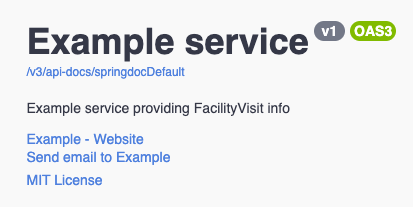

# Explore the Starter Kit Features

- [Summary of Features](#summary-of-features)
    - [Future Roadmap](#future-roadmap)
- [Example Endpoints](#example-endpoints)
- [OpenAPI Spec](#openapi-spec)
- [Load/Performance Tests](#loadperformance-tests)
- [Tracing](#tracing)
- [Watching Kafka queues](#watching-kafka-queues)

---

## Summary of Features

- Spring-Boot application structure
- Three-tier service architecture
    - API interface with SpringMVC and OpenAPI annotations
    - A Controller class implementing the API interface
    - A Service layer, consisting of:
        - Service Provider Interface (SPI)
        - Provider implementation
    - A Persistence layer
- Unit / Integration testing
- Architectural fitness functions (to enforce 3-tier arch)
- Flyway database migration support
- Code coverage metrics and minimum coverage thresholds
- Build execution time tracking
- Endpoint security via Open Policy Agent
- Kafka support
- Open Telemetry integration
- Gatling load / performance testing
- Model data lifecycle notifications (i.e. data mutation events)
- Documentation support, using MkDocs (deploy to Github Pages)
- OpenAPI v3.0 support for generating docs from code
- Versioning support for dependency updates
- Versioning support for building application
- Helm charts for deployment
- Container support
    - Docker container creation (app, db-init, opa-init)
- Local execution support
    - Docker-Compose definition for running service and dependencies
    - Supporting Postgres, Kafka, Jaeger, OPA, Spring-Boot app

### Future Roadmap

- Feature flag management
- A/B Testing
- OAS API Linting
- Security/Compliance testing (NIST, PCI, CIS, AWSpec)
- Pitest testing
- Gatling SaaS
- OPA Unit testing
- Build performance monitoring
- DORA Metric tracking
- Local K8s execution

## Example endpoints

When the app starts, the databases are migrated but not seeded - meaning the tables are set up, but not populated with data.

Additional information about available REST endpoints can be found via the OpenAPI spec, detailed in a later section.

> *Note*: Running the Gatling load tests will populate data in the table(s) by making POST requests to Create endpoints.

### Create a resource

```bash
curl -i -d '{
    "userName": "mary.q.contrary",
    "pii": "987-65-4321",
    "firstName": "Mary",
    "lastName": "Contrary"
  }' \
  -H 'Content-Type: application/json' \
  -X POST \
  localhost:8080/v1/example/accounts
```

### Fetch a resource

```bash
curl -i localhost:8080/v1/example/accounts/<id-from-previous-response>
```

### Fetch a list of all resources

```bash
curl localhost:8080/v1/example/accounts
```

### Update a resource

```bash
curl -i -d '{
    "userName": "newUserName",
    "pii": "12356789",
    "firstName": "newFirstName",
    "lastName": "Contrary"
  }' \
  -H 'Content-Type: application/json' \
  -X PUT \
  localhost:8080/v1/example/accounts/<id-from-previous-response>
```

## Delete a resource

```bash
curl -i -X DELETE localhost:8080/v1/example/accounts/4947836d-de51-4ffe-b58c-a80a9482d0e1
```

## OpenAPI Spec

View the OpenAPI documentation for your service by navigating to [http://localhost:8080/swagger](http://localhost:8080/swagger) in your browser.

The OpenAPI specification is generated using [springdoc-openapi](https://springdoc.org/) which is configured using the `/app/src/main/resources/application.yml`

- The links in the header section can be configured using the `starter.openapi` properties
  
- The `springdoc` properties can also be used to control struture and format of the OpenApi spec generated
- [Swagger Core](https://github.com/swagger-api/swagger-core/wiki/Swagger-2.X---Annotations) provides annotations for openAPI to be used to modify contents of the spec like operation, media, security etc.

## Load/Performance Tests

In order to see the system working, attach a consumer to the Kafka queue.
Then run the performance test to generate traffic.

```bash
% scripts/consume-kafka.sh # <--- run this in a separate window
% ./gradlew :app:gatlingRun
```

The console output of the Gatling tests will provide a link to a browser view with details on the tests, e.g.

```text
Reports generated in 0s.
Please open the following file: /<path>/<to>/<project>/app/build/reports/gatling/<api-name>simulation-<timestamp>/index.html
== CSV Build Time Summary ==
Build time today: 6:50.347
Total build time: 6:50.347
(measured since 8 minutes ago)
```

## Tracing

View the Jaeger monitoring system by navigating to the [Jaeger UI](http://localhost:16686/ "Jaeger UI") in your browser.

### Watching Kafka queues

- With the docker-compose running (`./gradlew :app:dockerComposeUp`)
- Run the gatling load test to generate traffic (`./gradlew :app:gatlingRun`)
- Run the command-line consumer within a shell inside the kafka container

```bash
docker exec -it -u root docker_kafka_1 /bin/bash -c \
  '$KAFKA_HOME/bin/kafka-console-consumer.sh --from-beginning --bootstrap-server kafka:9092 --topic=example-entity-lifecycle'
```

or more simply:

```bash
scripts/consume-kafka.sh
```
