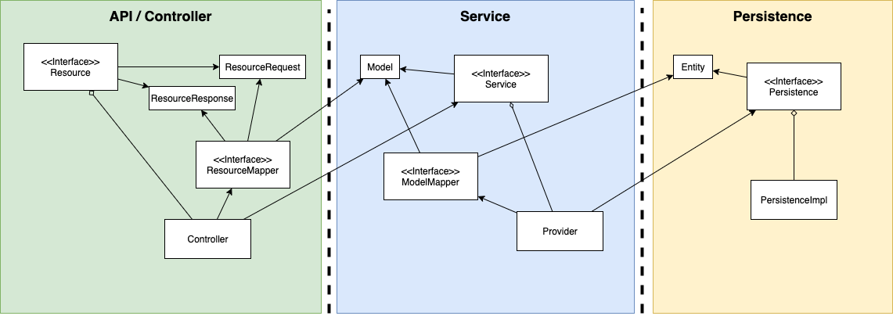

# Project Structure

- [Overview](#overview)
- [Docs](#docs)
- [App](#app)
- [API](#api)
    - [Controller](#controller)
- [Service](#service)
    - [Service Provider Interface (SPI)](#service-provider-interface-spi)
    - [Provider](#provider)
- [Persistence](#persistence)
    - [Persistence API](#persistence-api)
    - [Persistence Implementation](#persistence-implementation)

---

## Overview

The generated service architecture is organized into three tiers of functionality:

1. API / Controller
1. Service (business logic)
1. Persistence

Each tier defines interfaces for the functionality, with implementations of the interfaces as separate packages.
Each tier also defines its own data model, using MapStruct to translate between itself and its dependency tier (i.e. lower tier).
This maximizes long-term maintainability and promotes the ability to migrate each of the tiers independently.



## Skeleton Project Structure

```text
project
└─skeleton/
   │ .pre-commit-config.yaml
   │ README.md
   │ build.gradle    
   │ gradle.properties
   │ settings.gradle
   └─api/
   └─app/
   └─buildSrc/
   └─controller/
   └─data/
   └─docs/
   └─flyway/
   └─helmchart/
   └─init-container/
   └─opa-init/
   └─persistence/
      └─impl/
      └─model/
   └─scripts/
   └─docs/
   └─service/
      └─provider/
      └─spi/
```

## Docs

This project's README is intended for developers/maintainers of this project, while documentation located under the `/docs` directory is intended for users/consumers of this project.
This will allow your team to provide product documentation to the users who consume your application.
The documentation is meant to be publishable via MkDocs to github pages via `gradlew deployDocToGithubPages`.

## App

This is the main Spring Boot Application, which contains whatever specific configuration classes and includes the components which make up the application (persistence, api, spi, spi-implementation).

SPI Implementations may be either internal or external.
Spring affords an easy way of dynamically constructing the Factory by auto-registering implementations of an interface via configuration beans based on packages included in the classpath.

## API

This is the interface for the service, which should include the Request and Response payload objects.

We are currently using Lombok to minimize the boilerplate code necessary for the payload objects.
There exist arguments in favor of the use of Immutables, which provides much of the same benefits of Lombok without such invasive implementation requirements.

### Controller

This is the implementation of the API interface, and should only depend on the service SPI.
The controller has responsibility for transforming the SPI model to the API model.

## Data

The data package provides a set of canned test data.
There are data factories specified for each entity type, along with two data loader classes.
One class loads the data from a properties file, which are located in the `./src/main/resources` folder.
Another loader class provides hardcoded data to the factory

## Service

### Service Provider Interface (SPI)

This is an optional component, depending on the structure and domain of what is being built.
Assume you should have it, and that you should be able to justify why you don't.
This pattern forces you to think in terms of interfaces for the various components of your service.

Take Notifications as an example.
At a high level, as a consumer of this API, I just want to notify someone.
At the lower level, there may be different ways of notifying someone, configurable by the person, including email or SMS.
Email and SMS would be individual SPI implementations, because at the higher level of the service, I just want to track that the notification was sent out.

Further, there may be a future mechanism for notifications, which would only require a configuration capability for the user to select the new method, and a new SPI implementation registered with the service.

Generally, adopting this pattern helps a lot with testability, and migrating underlying services in the future.

### Provider

This is the main implementation package, which implements the service.
Ideally, it is a thin glue layer between the REST API and the SPI implementations.
Data validation, security (if not already delegated out to Service Mesh), logging and metrics capture should happen here.

Business logic should primarily reside behind the SPI interface(s), and the specific implementations which execute the business logic.
This pattern easily accommodates plugin architectures at the SPI level, supported by factory objects.

The service/provider has the responsibility for translating from the SPI model to the Persistence model.
It should only depend on the Persistence model, and perhaps other services SPIs.

## Persistence

### Persistence API

Explicitly separating persistence into api and impl may seem like a bit of overkill to some.
Many prefer just using Spring JPA interfaces for the repositories.

While that is usually an ok approach, occasionally we may have need for implementing other capabilities (e.g. C*).
Keeping with the interface-first design pattern preserves optionality and promotes testability.

The persistence model objects also live here in the persistence/api package.

### Persistence Implementation

Depending on the choice on the persistence/api side (e.g. Spring JPA), we may or may not need to provide any implementations.
However, it is still useful to have in cases where custom queries need to be implemented.
